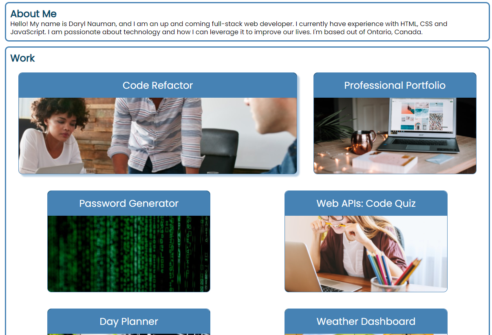

02 Advanced CSS: Portfolio Homework Assignment

## Description
The focus of this homework assignment for the University of Toronto SCS Coding Boot Camp was to create an initial portfolio of work samples (and placeholders for future work). The web application also includes my name, a photo, an about me section, and contact information. We were not provided with starter code and I created the site from scratch using HTML and CSS. In particular, I used recently learned concepts including flexbox, media queries and CSS variables.

## Key Features
- Flexbox is used for the header, navigation bar, work and contact me sections to provide a responsive layout
- The UI will scroll to the appropriate section when navigation bar links are clicked
- Flex-grow is used on the first work card so it displays larger than the others
- A pseudo-class selector is used on the navigation bar and contact me items to change how they are displayed when hovered over
- When the user hovers over a card representing a sample of work the CSS transition property is used to display a CSS box-shadow
- When a work card is clicked on the user is taken to that deployed applicaton in a new window/tab or if the application is not yet deployed the UI will scroll to the start of the work section
- A media query is used to switch the flex-direction to column on the header and contact list along with other adjustments to improve the appearance on smaller screens
- CSS variables were used for colors used frequenly and values can easily be changed resulting in a revised look throughout the site

## Link
Website can be found here: https://darylnauman.github.io/portfolio-page/

## Screenshot
The following image shows a snapshot of a portion of the webpage:

